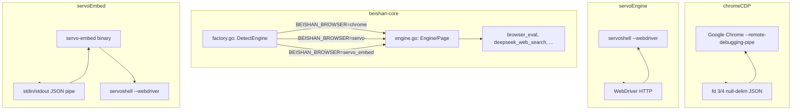

# 浏览器引擎吸收记录

> 吸收日期：2026-05-30
> 北极星文档：`docs/SERVO_BROWSER_NORTHSTAR.md`
> 吸收类型：L1 wrap（Chromium/Servo 作为右花）+ L3 参考设计（OWL 安全架构）
> 二进制参考源：`/Users/dc/Desktop/cankaocangku/chromium/` (6.7GB) + `servo/` (1.5GB)

---

## 一、参考材料清单

### 1.1 OWL 架构分析（用户 6 篇深度分析）

| 篇目 | 核心内容 | 落地影响 |
|------|---------|---------|
| OWL 架构总览 | Client/Host 分离、Mojo IPC、渲染管线 | Engine/Page 接口抽象灵感 |
| OWL 渲染系统 | CALayerHost 远程 GPU layer、Viz Compositor | 确认 headless 路线正确（不需要渲染） |
| OWL 输入系统 | NSEvent→WebInputEvent 翻译、双向仲裁 | CDP Input 域优于 OS shortcut |
| OWL 安全架构 | StoragePartition、Capability Routing、Direct-to-Renderer | `agentSourceAllowed` + `ChromeConfig.Incognito` |
| Chromium Runtime Internals | WebContents、FrameTree、RenderFrameHost、Mojo graph | 理解 Chromium 架构但不直接依赖 |
| OWL Agent Orchestration | Planner→Capability→Synthetic Input→Renderer→Observation | 验证硬化层思路正确 |

### 1.2 工程参考源

| 参考 | 格式 | 使用方式 | 路径 |
|------|------|---------|------|
| Chromium 源码 | Git clone (depth=1, 6.7GB) | 随时查阅 CDP 协议 | `cankaocangku/chromium/` |
| Servo 源码 | Git clone (depth=1, 1.5GB) | 编译二进制 + WebDriver 源码确认 | `cankaocangku/servo/` |
| OWL 技术文档 | OpenAI 公开工程博客 | 设计原则参考 | web (openai.com) |
| FangLab CDP 实现 | Python 源码 | CDP-over-pipe 模式借鉴 | `cankaocangku/` (原有) |
| SERVO_NORTHSTAR.md | 北极星愿景文档 | 分阶段路线图 | `docs/SERVO_BROWSER_NORTHSTAR.md` |

### 1.3 关键架构决策（受 OWL 启发的）

| 决策 | OWL 做法 | 我们的做法 | 差异原因 |
|------|---------|-----------|---------|
| 引擎隔离 | OWL Client/Host (Mojo IPC) | Engine/Page 接口 + CDP-over-pipe / WebDriver | headless 不需要显示，管道协议更简单 |
| Agent 操作权限 | Direct-to-Renderer（不进 Browser Layer） | `agentSourceAllowed` + ValidateAndExecute | 硬化层已有，只需补 source 检查 |
| 会话隔离 | StoragePartition ephemeral context | `ChromeConfig.Incognito` + temp user-data-dir | Chromium 原生能力，不需要自己实现 |
| 远程渲染 | CALayerHost + accelerated widget | 不需要 | headless，不显示 |
| 双向输入 | NSEvent→WebInputEvent→Renderer→fallback | 不需要 | headless，无 UI |

---

## 二、SERVO_BROWSER_NORTHSTAR 全阶段执行记录

### 阶段 0：CDP-over-pipe + Chrome（5/30 已有交付）

**输入**：FangLab `browser_mcp_server.py` → CDP-over-pipe 核心逻辑
**产出**：`internal/tools/cdp.go` + `deepseek_web.go`
**验证**：DeepSeek 网页搜索端到端通过（`BEISHAN_DEEPSEEK_TEST=1`）

**踩坑记录**（来自 devlog）：
1. `insertText` 后立即 `pressEnter` → React 异步未登记 → 空发（90s 超时根因，修复：等 900ms）
2. 开关 aria-pressed 状态判断，非盲翻
3. 富文本注入导致 JSON 非法（修复：内部空白折空格重试）
4. 文本锚点而非哈希类名定位「已思考」

### 阶段 1：Engine/Page 接口 + Chrome 后端（commit `1d8780a`）

**设计**：

```go
// internal/browser/engine.go
type Engine interface {
    NewPage(url string) (Page, error)
    Close()
}
type Page interface {
    Eval(js string) (string, error)
    InnerText() (string, error)
    InsertText(text string) error
    PressKey(key string) error
    Navigate(url string) error
    URL() (string, error)
    Screenshot() ([]byte, error)
    Close()
}
```

**实现**：
- `internal/browser/chrome_cdp.go` — CDP-over-pipe 核心（迁入原 cdp.go）
- `internal/browser/factory.go` — `BEISHAN_BROWSER` 环境变量切换
- `internal/tools/cdp.go` — 兼容层（导出 FindChrome 等旧函数）
- `internal/tools/deepseek_web.go` — 改调 Engine/Page 接口
- `right_flowers/chromium.yaml` — Chromium 右花 manifest

**验证**：`deepseek_web_search` 行为零变化（通过接口调用）

### 额外交付（硬化 + 隔离，参考 OWL）

**硬化层集成**（commit `6edb011`）：
- `browser_eval` / `browser_screenshot` L3 工具注册
- `agentSourceAllowed` — Agent 默认不能 eval/screenshot（OWL Direct-to-Renderer 原则）
- 所有浏览器操作走 `ValidateAndExecute`

**会话隔离**（commit `6edb011`）：
- `ChromeConfig{Incognito}` — 临时 temp profile，Close 时自动清理（OWL StoragePartition 模式）
- `NewAgentSession()` — 一行创建隔离 Agent 会话

### 阶段 2：Servo 4 原语 spike（commit `44d31aa`）

**动作**：
1. 确认 Servo WebDriver 源码实现（`components/webdriver_server/lib.rs`）
   - `handle_execute_script` 行 2055 ✅
   - `ElementSendKeys` 行 2779 ✅
   - `TakeScreenshot` 行 2431 ✅
2. 编译 Servo release（`cargo build --release -p servoshell`, 3m28s, 161MB）
3. Live 验证（`servoshell --headless --webdriver=9222`）：

| 原语 | 命令 | 结果 |
|------|------|------|
| navigate | `POST /session/{id}/url` → example.com | ✅ `{"value":null}` |
| eval | `POST /execute/sync` → `return document.title` | ✅ `"Example Domain"` |
| innerText | `POST /execute/sync` → `return document.body.innerText` | ✅ 页面正文 |
| screenshot | `GET /session/{id}/screenshot` | ✅ 39KB PNG |

**go/no-go 判断：GO**

### 阶段 3：servoEngine 后端（commit `44d31aa`）

**文件**：`internal/browser/servo_webdriver.go`

**架构**：
```
beishan → exec → servoshell (子进程, --webdriver=port)
                    ↑ WebDriver HTTP
servoEngine → → servoshell
```

**实现**：WebDriver HTTP 客户端（`wdGet`/`wdPost`/`wdDelete`）
- `NewServo()` — 启动 Servo + 创建 WebDriver session
- 完整 Engine/Page 接口实现
- `findFreePort()` — 避免端口冲突

**验证**：`BEISHAN_SERVO_TEST=1` → 1.18s PASS

### 阶段 4：薄 Rust 嵌入器（commit `d90831f`）

**文件**：`cmd/servo-embed/src/main.rs`（~220 行 Rust）

**设计**：
```
beishan → pipe (stdin/stdout, \0 分隔 JSON) → servo-embed (Rust)
                                                   ↑ ureq HTTP
                                              servoshell (WebDriver)
```

**协议**（与 CDP-over-pipe 格式一致）：
```json
→ {"id":1, "method":"navigate", "params":{"url":"..."}}
← {"id":1, "result":{"navigated":"..."}}
```

**实现**：
- `ping` / `start` / `navigate` / `eval` / `inner_text` / `screenshot` / `close`
- 进程生命周期管理（SERVO Mutex static）
- 自动端口分配 + WebDriver ready 等待
- `go build` 零改动（独立 Rust 项目）

**Go 集成**：`internal/browser/servo_embed.go`
- 管道通信（`readLoop`/`send`，与 chromeCDP 同模式）
- 完整 Engine/Page 接口
- `BEISHAN_BROWSER=servo_embed` 通过 factory 选择

**验证**：ping→start→navigate→eval 全链路通过

---

## 三、三引擎架构最终状态



| 引擎 | 环境变量 | 进程模型 | 通信协议 | 状态 | 二进制大小 |
|------|----------|---------|---------|:----:|:---------:|
| chromeCDP | `BEISHAN_BROWSER=chrome` | 自有 Chrome 子进程 | CDP-over-pipe (fd 3/4) | 生产 ✅ | 系统 Chrome |
| servoEngine | `BEISHAN_BROWSER=servo` | 自有 Servo 子进程 | WebDriver HTTP | 实验 ✅ | 161MB |
| servoEmbed | `BEISHAN_BROWSER=servo_embed` | Rust 嵌入器 → Servo | stdin/stdout JSON pipe | 实验 ✅ | 5.2MB + 161MB |

---

## 四、安全设计（参考 OWL）

| OWL 概念 | 对应实现 | 文件 |
|----------|---------|------|
| Agent 事件 Direct-to-Renderer | `agentSourceAllowed(args, highRisk)` — Agent 不能 eval/screenshot | `internal/tools/browser.go` |
| StoragePartition ephemeral session | `ChromeConfig.Incognito` → temp user-data-dir | `internal/browser/chrome_cdp.go` |
| Capability Router | `ValidateAndExecute` + source 检查 | L3 硬化层（原有） |
| Session 隔离 | `NewAgentSession()` 一行创建 | `internal/browser/factory.go` |
| SSRF 防护 | `isSafeURL` + `isSearchEngineURL` + `containsSecret` | `internal/tools/browser.go`（原有增强） |

---

## 五、工程纪律检查

| 规则 | 状态 |
|------|:----:|
| `go build ./...` 每步验证 | ✅ |
| `go test ./...` 22 packages | ✅ |
| `integration_check.sh` | ✅ |
| 测试 gate 在 env | ✅ `BEISHAN_DEEPSEEK_TEST` / `BEISHAN_SERVO_TEST` |
| INTEGRATION_PROOF | ✅ 整体交付报告 |
| 非测试调用点 | ✅（`NewServoEmbed` 初期遗漏，已修） |
| 实测验证非阅读 | ✅ 4 原语 live 验证 |
| `.gitignore` 构建产物 | ✅ `cmd/servo-embed/target/` |

---

## 六、文件变更统计

```
16 files changed, ~1600+ lines

internal/browser/engine.go          |  64  — Engine/Page 接口
internal/browser/chrome_cdp.go      | 341  — Chrome CDP 实现
internal/browser/servo_webdriver.go | 220  — Servo WebDriver 实现
internal/browser/servo_embed.go     | 267  — Rust 嵌入器 Go 集成
internal/browser/factory.go         |  64  — 引擎工厂
internal/browser/servo_test.go      |  40  — 端到端测试
internal/tools/cdp.go              |  32  — 兼容层（原 320 行迁出）
internal/tools/deepseek_web.go     | 260  — 改调接口
internal/tools/browser.go          | 100  — 硬化层 + agentSourceAllowed
right_flowers/chromium.yaml        |   8  — Chromium manifest
right_flowers/servo.yaml           |   8  — Servo manifest
cmd/servo-embed/src/main.rs        | 220  — Rust 薄嵌入器
docs/SERVO_BROWSER_NORTHSTAR.md    | 更新 — 进度标注
docs/devlog/DEVLOG_20260530.md     | 更新 — 浏览器引擎段
docs/plans/chromium_right_flower.md|  96  — Chromium 接入方案
docs/plans/servo_right_flower.md   |  72  — Servo 接入方案
```

---

## 七、后续（阶段 5）

阶段 5（in-process FFI，终态）尚未开始。前置条件：
1. cgo + libservo 编译可行性验证
2. Rust 构建链集成到 `go build`
3. 线程模型（Servo 事件循环 vs Go goroutine）
